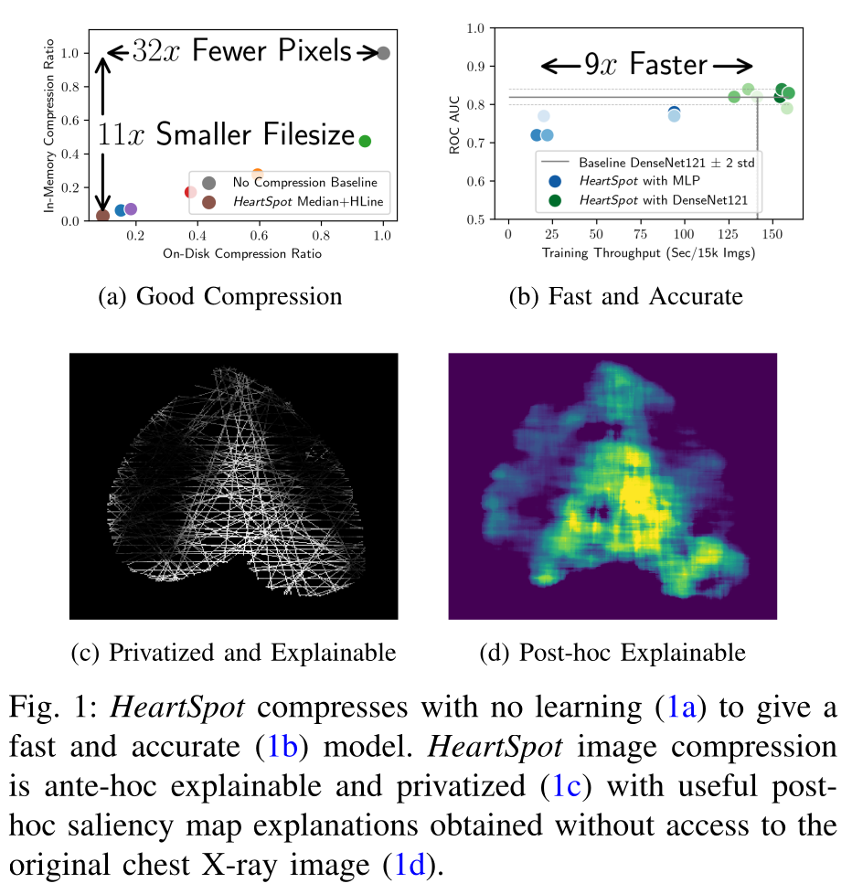

*HeartSpot*: Privatized and Explainable Data Compression for Cardiomegaly Detection
===

This repository contains code for the BHI 2022 conference paper.

- Paper on ArXiv:  http://arxiv.org/abs/2210.02241
- Paper on IEEE:   https://doi.org/10.1109/BHI56158.2022.9926777




- Citation:

```
Johnson, E., Mohan, S., Gaudio, A., Smailagic, A., Faloutsos, C., & Campilho, A. (2022, September). HeartSpot: Privatized and Explainable Data Compression for Cardiomegaly Detection. In 2022 IEEE-EMBS International Conference on Biomedical and Health Informatics (BHI) (pp. 01-04). IEEE.
```

- Bibtex:

```
@inproceedings{heartspot,
  title={{HeartSpot}: Privatized and Explainable Data Compression for Cardiomegaly Detection},
  author={Johnson, Elvin and Mohan, Shreshta and Gaudio, Alex and Smailagic, Asim and Faloutsos, Christos and Campilho, Aur{\'e}lio},
  year={2022}, month={10},
  booktitle={IEEE-EMBS International Conference on Biomedical and Health Informatics (BHI)},
  pages={01--04},
  organization={IEEE},
  url = {https://doi.org/10.1109/BHI56158.2022.9926777}
}
```


Reproducibility
===

The code used for the paper was extracted from a code repository that contained code for another project.  I attempted to extract only the relevant material pertaining to this paper.  Please let me know how to fix an issue or otherwise if you encountered one.

#### Git clone this repository and cd into it

```

$ git clone https://github.com/adgaudio/HeartSpot.git
$ cd HeartSpot
```

#### Download the CheXpert-v1.0-small dataset into `./data/`

CheXpert dataset download link:  https://stanfordmlgroup.github.io/competitions/chexpert/

```
# after downloading, ensure your directory structure matches this
$ find ./data/CheXpert-v1.0-small/ -maxdepth 1
    data/CheXpert-v1.0-small/
    data/CheXpert-v1.0-small/train.csv
    data/CheXpert-v1.0-small/train
    data/CheXpert-v1.0-small/valid
    data/CheXpert-v1.0-small/valid.csv

# note that the dataset is about 12gb
$ du -sm data/CheXpert-v1.0-small/
    12366   data/CheXpert-v1.0-small/
```

#### Set up your python environment.

I used anaconda with python 3.9.7 and these packages.

Hopefully this is all packages; the same environment was used for another project and had other packages installed.  Raise an issue and suggest how to update the Readme if there is a missing requirement.

```
$ conda create -n heartspot python=3.9
$ conda activate heartspot 
$ conda install scipy numpy matplotlib IPython seaborn pandas
$ conda install scikit-learn termcolor
$ pip install torch==1.9.1 torchvision==0.10.1 captum==0.4.0

$ pip install --no-deps opencv-python
$ pip install efficientnet-pytorch pampy==0.3.0 simple-parsing==0.0.17

$ pip install --no-deps simplepytorch==v1.0.0
```

#### Reproduce the HeartSpot experiments:

Results will be saved into `./results`

Note 1:  You may want to review the code yourself before running it.  The script expects you
have redis-server installed and running and will try to parallelize jobs across
all available GPUs on the local machine.  I suggest to review the file `bin/experiments_heartspot.sh`, starting from the last lines of the file.

Note 2: I used two GPUs with 11gb of GPU RAM, a CPU with 24 cores and 128GB RAM.
You may need to tweak num_workers and batch_size accordingly. 

Note 3: By default, if you just run
the "python heartspot/train.py ..." part of each command without the stuff before it, and without explicitly passing `--experiment_id` or using an environment variable like `run_id=myexperiment123`, the results will write to `./results/debugging`.


```
$ ./bin/experiments_heartspot.sh
```

As jobs run, you'll see output like this:
```
$ ls results/*.HL8*
'results/5.HL8.densenet121:untrained:1:1.':
20220507T183954.263817971_console.log  checkpoints           lock      log
20220507T183954.263817971_git.log      class_thresholds.csv  lock.log  perf.csv

results/5.HL8.heart.:
20220503T154105.284457043_console.log  checkpoints           lock  perf.csv
20220503T154105.284457043_git.log      class_thresholds.csv  log

results/5.HL8.heart+densenet.:
20220505T181610.866709553_console.log  checkpoints           lock      log
20220505T181610.866709553_git.log      class_thresholds.csv  lock.log  perf.csv

...
```

#### Reproduce figures or parts of figures used in the paper:

Review and run any of these:
```
$ ls bin/plot*hline*
 bin/plot_hline_acc_vs_time.py      bin/plot_hline_getsaliency2.py
 bin/plot_hline_archdiagramfigs.py  bin/plot_hline_getsaliency.py
```
